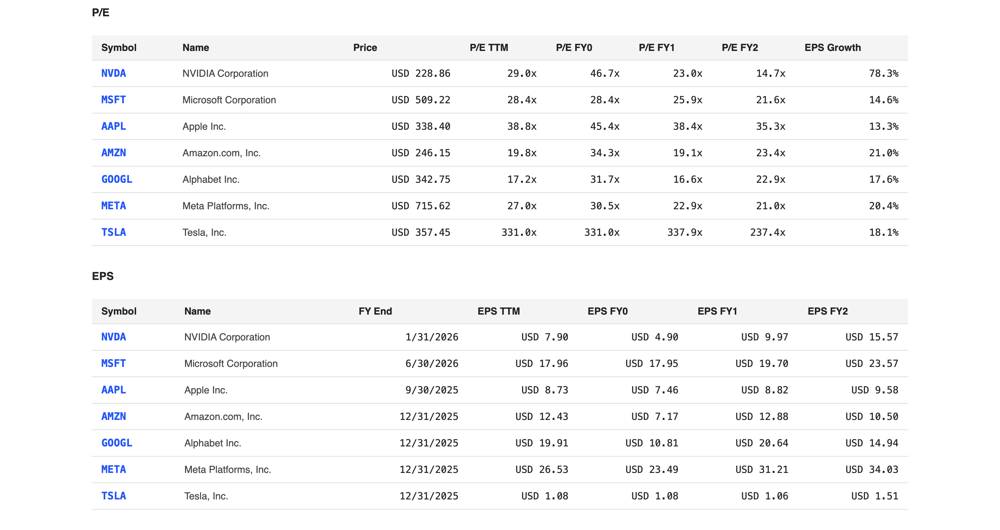
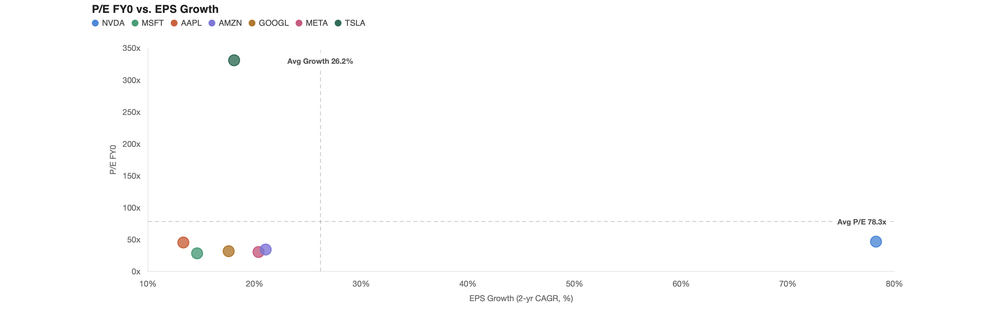
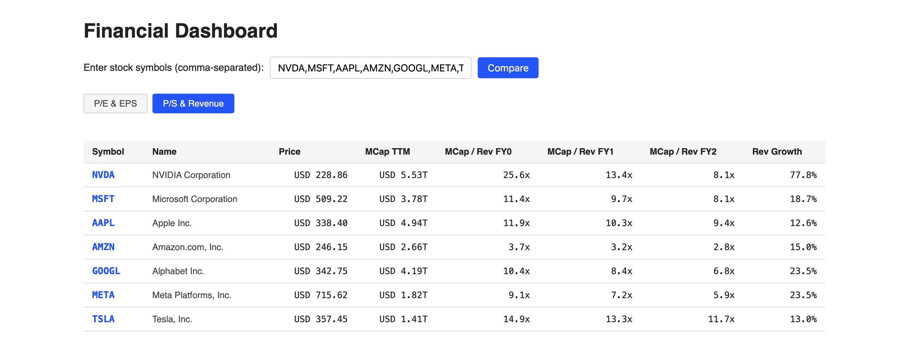
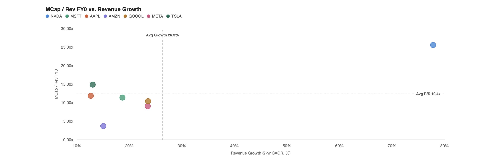
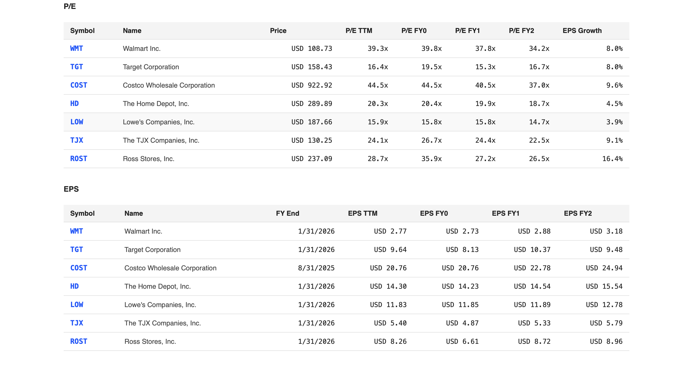
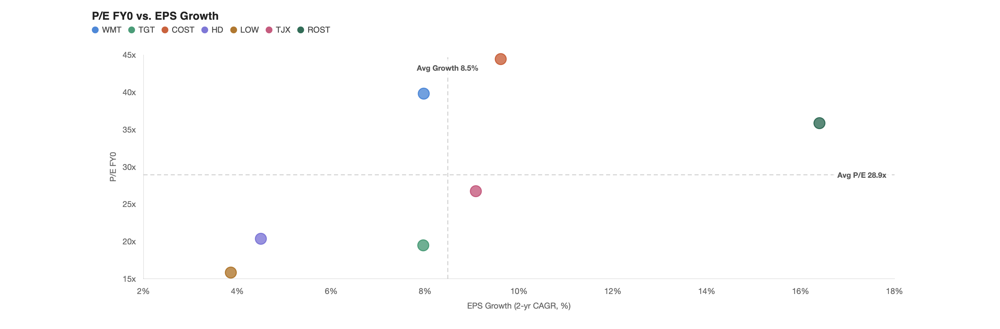
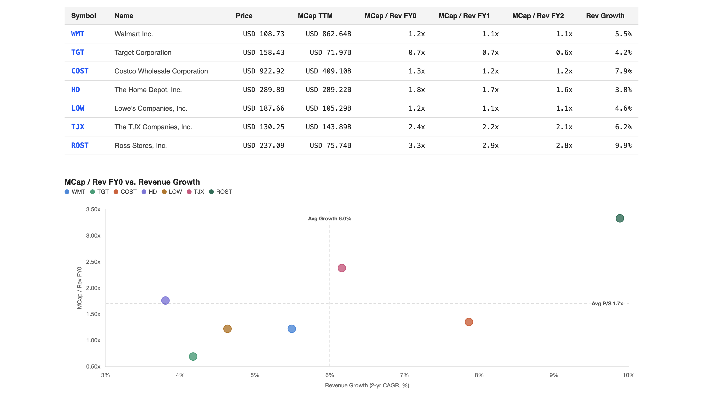

# Financial Dashboard

## Introduction
A web-based financial dashboard for stock analysis and side by side comparisons, expanding on Yahoo Finance's existing tools. Users can enter any ticker to then see its actual and forward valuation, earnings and revenue metrics.
Built with Python (Flask) on the backend, yfinance for market data, HTML, CSS, and Chart.js for visualizations.

## Core fuctionalities
The dashboard has two tabs, both connected by the same user ticker input:
- P/E & EPS consists of
    - two tables (both showing actual + analyst estimates for the current and next fiscal years):
        - P/E table with trailing and forward P/E ratios and EPS growth. Clicking a ticker in this table expands a chart showing how that stock's forward P/E has shifted over the last 90 days.
        - EPS table with trailing and forward EPS. Clicking a ticker in this table expands a chart showing how that stock's actual EPS over the past 3 years, current year EPS, and estimates for the next 2 years, connected by historical and forward CAGRs.
    - a scatter chart plotting P/E for the current year against EPS growth, split into quadrants based on the group average.
- P/S & Revenue consists of
    - a table with trailing MCap, current and forward MCap/Rev ratios, and revenue growth. Clicking a ticker in this table expands a chart showing how that stock's actual revenue over the past 3 years, current year revenue, and estimates for the next 2 years, connected by historical and forward CAGRs.
    - a scatter chart plotting MCap/Rev for the current year against Revenue Growth, split into quadrants based on the group average.

**Worth noting:**
- Cross-currency handling — some stocks (foreign listings, ADRs) trade in one currency but report financials in another (e.g. a Hong Kong-listed share trading in HKD with USD-denominated earnings), and UK-listed shares are quoted in pence rather than pounds. The app detects each ticker's actual trading and financial-reporting currencies and converts everything to a consistent basis using live exchange rates. A stock is only flagged as invalid if no exchange rate can be found at all.
- Tiered caching — live price data is cached briefly (worth refreshing often), while slower-moving fundamentals (EPS/revenue estimates, historicals) are cached for hours, balancing data recency and the rate limits set by the free data source.

**Limitations:**
- This app's accuracy is limited by Yahoo Finance's own data quality. Beyond the mismatches handled above, Yahoo is occasionally inconsistent by reporting data in different currencies, causing possible discrepancies in case of foreign listings and ADRs.

## Example Analysis

### Magnificent Seven
**P/E vs. EPS Growth**





Group averages: P/E FY0 ≈ 78.3x, EPS Growth ≈ 26.2% — both well above where most of the group actually sits, because Tesla's P/E (331.0x) and Nvidia's growth rate (78.3%) are extreme outliers that drag their respective averages up with them.

Nvidia is the only stock in this quadrant with below-average P/E, above-average growth — its 46.7x P/E looks expensive in, but is actually below the group average once Tesla's multiple is factored in, while its 78.3% growth rate is nearly 3x the next-highest stock in the group. Apple, Microsoft, Alphabet, Amazon, and Meta all cluster in "below-average P/E, below-average growth," and Tesla sits alone in "above-average P/E, below-average growth" — the most expensive stock in the group by a wide margin, with growth (18.1%) below the Mag 7 group average.

-Forward_PE_Trend_chart.png)

**Forward P/E re-rating over the past 90 days:**
- Nvidia: 15.7x → 14.7x, **−6.4% (de-rated)**
- Microsoft: 16.2x → 21.6x, **+33.3% (re-rated up)**
- Apple: 29.9x → 35.3x, **+18.1% (re-rated up)**
- Amazon: 23.9x → 23.4x, **−2.1% (roughly flat)**
- Alphabet: 24.6x → 22.9x, **−7.0% (de-rated)**
- Meta: 16.1x → 21.0x, **+30.4% (re-rated up)**
- Tesla: 209.1x → 237.4x, **+13.5% (re-rated up)**

Four of the seven re-rated meaningfully higher over the quarter — the market is paying more per dollar of forward earnings for Microsoft and Meta in particular than it was three months ago. Alphabet is the one with the clearest de-rate.

**EPS - Actual vs. Estimate**

-EPS-actual_vs._estimate.png)

Nvidia's EPS chart shows the most dramatic growth curve of the group — a steep climb from historical actuals into the forward estimates, visually the sharpest jump of any stock in the Magnificent Seven.

**MCap/Rev vs. Revenue Growth**





Group averages: MCap/Rev FY0 ≈ 12.4x, Revenue Growth ≈ 26.3%. Unlike the P/E view, no stock here lands in the "below-average multiple, above-average growth" quadrant. Nvidia — the standout on the earnings side — is actually the most expensive stock in the group on a revenue basis (25.6x), paired with its massive 77.8% growth. Amazon stands out for the opposite reason: by far the cheapest on MCap/Rev (3.7x) of the seven, though its growth (15.0%) sits below the group average too.

### Retail
**P/E vs. EPS Growth**





Group averages: P/E FY0 ≈ 28.9x, EPS Growth ≈ 8.5% — no single outlier distorts these the way Tesla and Nvidia do above, so the split is more evenly spread.

TJX is the only stock in this quadrant with below-average P/E, above-average growth, and narrowly — its 26.8x P/E and 9.1% growth both sit just on the favorable side of the group average. Ross Stores and Costco both trade above-average on both axes, but for different reasons: Ross's premium (35.9x) is supported by its growth rate (16.4%, the highest in the group), while Costco's premium (44.5x, the highest P/E in the group) comes with only middling growth (9.6%). Walmart, Home Depot, and Lowe's all fall in "below-average P/E, below-average growth, in this comparison.

-Forward_PE_Trend_chart.png)

**P/E re-rating over the past 90 days:**
- Walmart: 34.9x → 34.2x, **−2.0% (roughly flat)**
- Target: 14.8x → 16.7x, **+12.8% (re-rated up)**
- Costco: 37.4x → 37.0x, **−1.1% (roughly flat)**
- Home Depot: 22.4x → 18.6x, **−17.0% (de-rated)**
- Lowe's: 16.6x → 14.7x, **−11.4% (de-rated)**
- TJX: 26.3x → 22.5x, **−14.4% (de-rated)**
- Ross Stores: 24.8x → 26.5x, **+6.7% (re-rated up)**

Home improvement (Home Depot, Lowe's) and TJX all de-rated meaningfully over the quarter, while Target and Ross Stores re-rated upward.

**MCap/Rev vs. Revenue Growth**



Group averages: MCap/Rev FY0 ≈ 1.71x, Revenue Growth ≈ 6.0%. Costco is the one stock in the "below-average multiple, above-average growth" quadrant here — a notable contrast to the P/E view, where it had the highest earnings multiple in the group. Its low-margin, high-volume membership model may mean that it looks expensive on an earnings basis but reasonably priced relative to revenue, with growth that supports that valuation.

**Revenue - Actual vs. Estimate**

-revenue-actual_vs._estimate.png)

Costco's revenue grew from $226.95B to $275.24B over the three fiscal years shown (~6.6% historical CAGR), with forward estimates projecting continued growth at a similar pace (~7.9% projected CAGR) — a business built on consistency.

## How to Open
Clone the repo, install dependencies, and run it locally:

```bash
git clone https://github.com/cemacrae/financial_dashboard.git
cd financial-dashboard
python3 -m venv venv
source venv/bin/activate
pip install -r requirements.txt
python3 app.py
```
Then open `http://127.0.0.1:5001` in browser.

## Structure of Code
```
financial-dashboard/
├── app.py                  # Flask app: handles routes, data fetching/caching, formatting
├── requirements.txt        # Python dependencies
├── static/
│   └── style.css           # All styling for both pages
└── templates/
    ├── index.html          # P/E & EPS page
    └── ps_revenue.html     # P/S & Revenue page
```

`app.py` fetches data from `yfinance` in two tiers (fast-refreshing price, slow-refreshing fundamentals), formats it for display, and passes it to the Jinja2 templates, which render the tables and pass the underlying numbers to Chart.js for the visualizations.